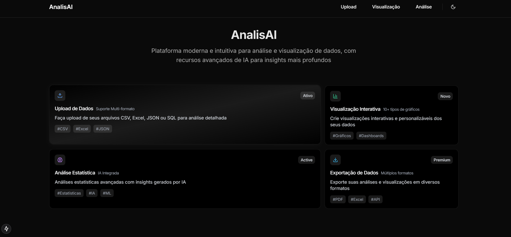

# AnalisAI - Plataforma de Análise de Dados



Uma plataforma moderna e intuitiva para análise e visualização de dados, com recursos avançados de IA para insights mais profundos.

## ✨ Features

- 📊 **Visualizações Interativas**: Diversos tipos de gráficos e dashboards
- 🤖 **IA Integrada**: Análises preditivas e insights automáticos
- 📁 **Multi-formato**: Suporte para CSV, Excel, JSON e SQL
- 🌓 **Tema Adaptativo**: Design elegante em modo claro e escuro
- 📱 **Responsivo**: Interface otimizada para todos os dispositivos

## Estrutura do Projeto

### Frontend (Next.js 14 + TypeScript)

```
frontend/
├── src/
│   ├── app/                    # Rotas e páginas
│   │   ├── page.tsx           # Página inicial
│   │   ├── layout.tsx         # Layout principal
│   │   ├── upload/            # Rota de upload
│   │   │   └── page.tsx       # Página de upload
│   │   ├── visualizacao/      # Rota de visualização
│   │   │   └── page.tsx       # Página de visualização
│   │   └── analise/          # Rota de análise
│   │       └── page.tsx       # Página de análise
│   ├── components/            # Componentes reutilizáveis
│   │   ├── ui/               # Componentes base
│   │   │   ├── button.tsx    # Componente Button
│   │   │   └── bento-grid.tsx # Grid de cards
│   │   ├── nav.tsx           # Navegação principal
│   │   └── theme-toggle.tsx  # Toggle de tema
│   ├── lib/                  # Utilitários
│   │   └── utils.ts         # Funções helpers
│   └── providers/            # Provedores de contexto
│       └── theme-provider.tsx # Provedor de tema
```

### Páginas Implementadas

#### 1. Página Inicial (`/`)
- Grid de cards com principais funcionalidades
- Design moderno com Bento Grid
- Cards interativos com hover effects
- Tema claro/escuro

#### 2. Upload (`/upload`)
- Área de drag-and-drop
- Suporte multi-formato (CSV, Excel, JSON, SQL)
- Upload único ou em lote
- Indicadores visuais de estado

#### 3. Visualização (`/visualizacao`)
- Diferentes tipos de gráficos
  - Gráfico de Barras
  - Gráfico de Linha
  - Gráfico de Pizza
  - Gráfico de Dispersão
- Recursos avançados de visualização
- Interface intuitiva

#### 4. Análise (`/analise`)
- Análise Preditiva com ML
- Análise Estatística
- Análise de Tendências
- Análise de Correlação
- Recursos de IA integrados

### Componentes Principais

#### UI Base
- `button.tsx`: Componente base de botão com variantes
- `bento-grid.tsx`: Grid de cards com efeitos visuais

#### Navegação
- `nav.tsx`: Barra de navegação responsiva
- `theme-toggle.tsx`: Alternador de tema claro/escuro

#### Providers
- `theme-provider.tsx`: Gerenciamento de tema com next-themes

### Estilização
- Tailwind CSS para estilos
- Sistema de cores neutras
- Modo escuro completo
- Animações e transições suaves
- Design responsivo

### Dependências Principais
- next
- react
- typescript
- tailwindcss
- lucide-react
- next-themes
- class-variance-authority
- clsx
- tailwind-merge

## Backend (Pendente)

### Funcionalidades Planejadas

1. **API REST com FastAPI**
   - Endpoints para upload de arquivos
   - Processamento de dados
   - Análise estatística
   - Geração de visualizações

2. **Processamento de Dados**
   - Pandas para manipulação
   - NumPy para cálculos
   - Scikit-learn para ML

3. **Banco de Dados**
   - PostgreSQL
   - SQLAlchemy ORM
   - Migrations

4. **Análise de Dados**
   - Análise estatística básica
   - Machine Learning
   - Previsões
   - Detecção de anomalias

5. **Segurança**
   - Autenticação
   - Autorização
   - Rate limiting
   - Validação de dados

### Próximos Passos

1. **Frontend**
   - [ ] Implementar lógica de upload
   - [ ] Integrar biblioteca de gráficos
   - [ ] Adicionar feedback de loading
   - [ ] Implementar validações

2. **Backend**
   - [ ] Configurar ambiente Python
   - [ ] Implementar FastAPI
   - [ ] Configurar banco de dados
   - [ ] Criar endpoints base
   - [ ] Implementar processamento de dados
   - [ ] Adicionar análises estatísticas
   - [ ] Integrar ML models
